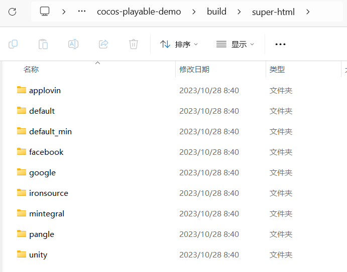

## [中文说明](https://github.com/magician-f/cocos-playable-demo/tree/main/README-CN.md)

## [cocos-playable-demo](https://github.com/magician-f/cocos-playable-demo)

* An effective solution for creating playable demos using cocos creator
* Supports popular playable platforms: applovin, facebook, google, ironsource, mintegral, pangle, unity

* Supports cocos creator version > 3.5.0

## Getting Started

### 1. Integration of [sdk](https://github.com/magician-f/cocos-playable-demo/tree/main/docs/sdk/super_html_playable.ts)

#### Basic Integration
* Click the download button
```
super_html_playable.download();
```
* Redirect to the settlement page for gameplay
```
super_html_playable.game_end();
```

#### Additional Integration
* No need for download button: google
```
if (super_html_playable.is_hide_download()) {
    this.button_download.active = false;
}
```
* Set the store URL for download redirection: unity
```
const google_play = "https://play.google.com/store/apps/details?id=com.unity3d.auicreativetestapp";
const appstore = "https://apps.apple.com/us/app/ad-testing/id1463016906";

super_html_playable.set_google_play_url(google_play);
super_html_playable.set_app_store_url(appstore);
```

### 2. Install [packaging tool super-html](https://store.cocos.com/app/detail/3657)

super-html packages the built web-mobile into playable platform files

### 3. Packaging and Generation

* [View example of generated files](https://github.com/magician-f/cocos-playable-demo/tree/main/build/super-html)



### 4. Testing

#### Introduction to Playable Platforms

|Platform|Landscape/Portrait|Package Size|File Format|Testing|
|--|--|--|--|--|
|[applovin](https://p.applov.in/playablePreview?create=1&qr=1)|✔️|5M|html|[web](https://p.applov.in/playablePreview?create=1&qr=1)|
|[facebook](https://docs.lunalabs.io/docs/playable/ad-networks/facebook)|❔|5M|zip|-|[web](https://developers.facebook.com/tools/playable-preview/)|
|[google](https://support.google.com/google-ads/answer/9981650?hl=zh-Hans)|❌|5M|zip|-|[web](https://h5validator.appspot.com/adwords/asset)|
|[ironsource](https://developers.is.com/ironsource-mobile/general/interactive-requirements)|✔️|5M|html|[upload review](https://developers.is.com/ironsource-mobile/general/html-upload/)|
|[mintegral](https://www.mindworks-creative.com/review/doc)|✔️|5M|zip|[web](https://www.mindworks-creative.com/review/)|
|[pangle - tiktok](https://ads.tiktok.com/help/article/playable-ads)|❌|5M|zip|[upload review](https://ads.tiktok.com/help/article/playable-ads?lang=zh#anchor-19)|
|[unity](https://docs.unity.com/acquire/manual/playable-ads)|✔️|5M|html|[android, ios](https://storage.googleapis.com/unity-ads-aui-prod-deployments/external-app/UnityAds_Playable_guide.pdf)|

## [Frequently Asked Questions (QA)](./QA.md)

## Contact the Author

* WeChat: magician-f8
* Email: magician-f@qq.com